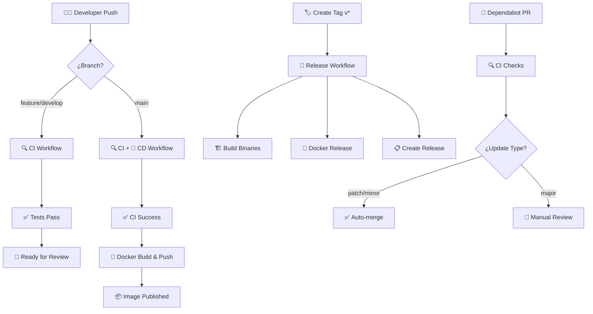

# 🚀 Workflows de CI/CD - BCV Currency API

Este directorio contiene los workflows de GitHub Actions para automatizar el proceso de CI/CD del proyecto BCV Currency API creado por **AndrusCodex**.

## 📋 Workflows Disponibles

### 1. 🔍 CI - Continuous Integration (`ci.yml`)

**Trigger:** Push y Pull Requests a `main` y `develop`

**Jobs:**
- **🔍 Code Linting**: Análisis estático con golangci-lint y gosec
- **🧪 Run Tests**: Tests con cobertura en múltiples versiones de Go
- **🏗️ Build Binaries**: Compilación multiplataforma (Linux, Windows, macOS)
- **🐳 Docker Build Test**: Verificación de build de Docker
- **🛡️ Security Analysis**: Escaneo de vulnerabilidades con Trivy

**Características:**
- ✅ Matriz de testing con Go 1.24.2 y 1.23.x
- ✅ Cache inteligente de módulos Go
- ✅ Reporte de cobertura a Codecov
- ✅ Análisis de seguridad SARIF
- ✅ Build multiplataforma con artifacts

### 2. 🐳 CD - Docker Build & Push (`cd.yml`)

**Trigger:** Push a `main`, tags `v*`, y manual dispatch

**Jobs:**
- **🐳 Build & Push**: Build y push de imágenes Docker multi-arquitectura
- **🛡️ Security Scan**: Escaneo de vulnerabilidades de la imagen
- **🧪 Test Docker Image**: Tests funcionales de la imagen
- **🏷️ Update Repository Tags**: Actualización automática de tags
- **📢 Deployment Notification**: Resumen del deployment

**Características:**
- ✅ Imágenes multi-arquitectura (linux/amd64, linux/arm64)
- ✅ Push automático a GitHub Container Registry
- ✅ Tags semánticos automáticos
- ✅ Escaneo de seguridad post-build
- ✅ Tests de integración de la imagen

### 3. 🏷️ Release - Create Tagged Release (`release.yml`)

**Trigger:** Tags `v*.*.*` y manual dispatch

**Jobs:**
- **🏷️ Create Release**: Creación de release con changelog automático
- **🏗️ Build Release Binaries**: Binarios optimizados multiplataforma
- **🐳 Docker Release Build**: Imágenes Docker con tags de release
- **🔐 Create Checksums**: Generación de checksums SHA256
- **📢 Release Notification**: Notificación de release exitoso

**Características:**
- ✅ Changelog automático desde commits
- ✅ Binarios comprimidos por plataforma
- ✅ Checksums SHA256 para verificación
- ✅ Release automático con assets
- ✅ Tags Docker semánticos

### 4. 🤖 Dependabot Auto-Merge (`dependabot-auto-merge.yml`)

**Trigger:** Pull Requests de Dependabot

**Características:**
- ✅ Auto-merge para updates patch y minor
- ✅ Review manual requerido para major updates
- ✅ Espera a que pasen todos los checks de CI

### 5. ⚙️ Dependabot Configuration (`dependabot.yml`)

**Configuración:**
- ✅ Updates semanales de dependencias Go
- ✅ Updates de GitHub Actions
- ✅ Updates de base images Docker
- ✅ Auto-asignación a AndrusGerman

## 🔄 Flujo de Trabajo Completo



## 📦 Artifacts Generados

### CI Workflow
- 📊 Reportes de cobertura (HTML y SARIF)
- 🏗️ Binarios de desarrollo por plataforma
- 🛡️ Reportes de seguridad

### CD Workflow
- 🐳 Imágenes Docker en `ghcr.io/AndrusGerman/gobcv`
- 📋 Resúmenes de deployment

### Release Workflow
- 📦 Binarios comprimidos por plataforma
- 🔐 Checksums SHA256
- 🐳 Imágenes Docker con tags semánticos
- 📝 Release notes automáticos

## 🏃‍♂️ Cómo Usar

### Para Desarrollo

1. **Feature Branch:**
   ```bash
   git checkout -b feature/nueva-funcionalidad
   git push origin feature/nueva-funcionalidad
   # ✅ Trigger CI workflow automáticamente
   ```

2. **Merge a Main:**
   ```bash
   git checkout main
   git merge feature/nueva-funcionalidad
   git push origin main
   # ✅ Trigger CI + CD workflows
   ```

### Para Releases

1. **Crear Release:**
   ```bash
   git tag v1.0.0
   git push origin v1.0.0
   # ✅ Trigger Release workflow automáticamente
   ```

2. **Release Manual:**
   - Ve a Actions → Release → Run workflow
   - Especifica el tag (ej: v1.0.1)
   - Marca como prerelease si es necesario

### Para Usar Imágenes Docker

```bash
# Última versión
docker pull ghcr.io/andrusgerman/gobcv:latest

# Versión específica
docker pull ghcr.io/andrusgerman/gobcv:v1.0.0

# Ejecutar
docker run -p 8080:8080 ghcr.io/andrusgerman/gobcv:latest
```

## 🔧 Configuración Requerida

### Secrets (Ya configurados automáticamente)
- `GITHUB_TOKEN`: Para push a registry y releases

### Permisos Requeridos
- `contents: write`: Para crear releases
- `packages: write`: Para push a container registry
- `security-events: write`: Para reportes SARIF

## 🛡️ Seguridad

- ✅ Escaneo automático de vulnerabilidades
- ✅ Reportes SARIF integrados
- ✅ Imágenes base mínimas (scratch)
- ✅ Binarios estáticos sin dependencias
- ✅ Auto-updates de dependencias

## 📈 Monitoreo

Los workflows incluyen:
- 📊 Métricas de build time
- 🧪 Resultados de tests
- 🔍 Reportes de cobertura
- 🛡️ Alertas de seguridad
- 📦 Estadísticas de artifacts

## 🎯 Próximos Pasos

Para mejorar el flujo, considera:
- 🌍 Deploy automático a staging/production
- 📊 Integración con Prometheus/Grafana
- 🔔 Notificaciones Slack/Discord
- 🧪 Tests de integración E2E
- 📋 Análisis de calidad de código

---

**Creado por:** AndrusCodex  
**Repositorio:** https://github.com/AndrusGerman/gobcv  
**Documentación:** [README.md](../../README.md)
