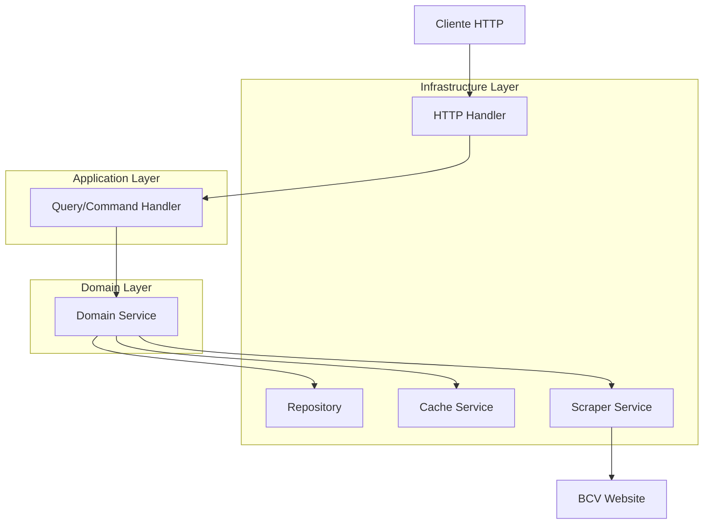

# BCV Currency API

Una API REST moderna para obtener tipos de cambio del Banco Central de Venezuela (BCV) implementada con arquitectura hexagonal, CQRS y caché en memoria.

## 🏗️ Arquitectura

### Arquitectura Hexagonal (Ports and Adapters)

```
cmd/api/                    # 🚀 Punto de entrada
├── main.go                # Configuración e inicialización

internal/
├── domain/                # 🏛️ Núcleo del dominio
│   ├── entity/           # Entidades de negocio
│   ├── repository/       # Puertos de repositorio
│   └── service/          # Puertos de servicios
│
├── application/          # 🎯 Casos de uso (CQRS)
│   ├── command/         # Comandos (escritura)
│   ├── query/          # Consultas (lectura)
│   └── service/        # Coordinadores de aplicación
│
└── infrastructure/      # 🔌 Adaptadores
    ├── http/           # API REST
    ├── cache/          # Caché y repositorio en memoria
    └── scraper/        # Scraping del BCV

pkg/
└── config/              # ⚙️ Configuración
```

### Patrones Implementados

- **🏗️ Arquitectura Hexagonal**: Separación clara entre dominio, aplicación e infraestructura
- **⚡ CQRS**: Separación de comandos (escritura) y consultas (lectura)
- **💾 Repository Pattern**: Abstracción del acceso a datos
- **🏭 Dependency Injection**: Inversión de dependencias
- **🚀 Clean Architecture**: Dependencias apuntan hacia el dominio

## 🚀 Características

- ✅ **API REST** completa con endpoints documentados
- ✅ **Caché en memoria** con TTL configurable y limpieza automática
- ✅ **Scraping robusto** del sitio web del BCV
- ✅ **Actualización automática** periódica de tipos de cambio
- ✅ **Manejo de errores** comprehensivo
- ✅ **Configuración por variables de entorno**
- ✅ **Graceful shutdown** para cierre limpio
- ✅ **Middleware de logging y CORS**
- ✅ **Documentación integrada** en la API

## 📋 Requisitos

- Go 1.24.2 o superior
- Conexión a internet para obtener datos del BCV

## 🛠️ Instalación

```bash
# Clonar el repositorio
git clone <repository-url>
cd gobcv

# Instalar dependencias
go mod tidy

# Compilar la aplicación
go build -o bin/api.exe cmd/api/main.go

# Ejecutar
./bin/api.exe
```

## 🚀 Uso

### Iniciar el servidor

```bash
./bin/api.exe
```

El servidor se iniciará en `http://localhost:8080` por defecto.

### Endpoints Disponibles

| Método | Endpoint | Descripción |
|--------|----------|-------------|
| `GET` | `/` | Documentación de la API |
| `GET` | `/api/v1/health` | Health check del servicio |
| `GET` | `/api/v1/currencies` | Obtener todas las monedas |
| `GET` | `/api/v1/currencies/{id}` | Obtener moneda específica (EUR, USD) |
| `POST` | `/api/v1/currencies/refresh` | Actualizar monedas desde BCV |
| `GET` | `/api/v1/cache/stats` | Estadísticas del caché |

### Ejemplos de Uso

```bash
# Obtener todas las monedas
curl http://localhost:8080/api/v1/currencies

# Obtener EUR específicamente
curl http://localhost:8080/api/v1/currencies/EUR

# Actualizar monedas forzadamente
curl -X POST http://localhost:8080/api/v1/currencies/refresh?force=true

# Obtener sin usar caché
curl http://localhost:8080/api/v1/currencies?cache=false
```

### Respuesta de la API

```json
{
  "success": true,
  "message": "Monedas obtenidas desde repositorio",
  "data": {
    "currencies": [
      {
        "id": "EUR",
        "name": "Euro",
        "value": 144.37,
        "updated_at": "2025-08-27T17:15:30Z",
        "source": "https://www.bcv.org.ve/"
      },
      {
        "id": "USD",
        "name": "Dólar Americano",
        "value": 168.34,
        "updated_at": "2025-08-27T17:15:30Z",
        "source": "https://www.bcv.org.ve/"
      }
    ],
    "count": 2,
    "from_cache": false
  },
  "timestamp": "2025-08-27T17:15:30Z"
}
```

## ⚙️ Configuración

La aplicación se configura mediante variables de entorno:

| Variable | Descripción | Valor por defecto |
|----------|-------------|-------------------|
| `SERVER_PORT` | Puerto del servidor | `8080` |
| `SERVER_HOST` | Host del servidor | `0.0.0.0` |
| `CACHE_DEFAULT_TTL` | TTL del caché | `5m` |
| `SCRAPER_REFRESH_INTERVAL` | Intervalo de actualización | `15m` |
| `SCRAPER_TIMEOUT` | Timeout del scraper | `30s` |

### Ejemplo de configuración

```bash
export SERVER_PORT=9000
export CACHE_DEFAULT_TTL=10m
export SCRAPER_REFRESH_INTERVAL=30m
./bin/api.exe
```

## 🏛️ Arquitectura Detallada

### Dominio (Domain Layer)

**Entidades:**
- `Currency`: Representa una moneda con ID, nombre, valor y metadatos

**Puertos:**
- `CurrencyRepository`: Interfaz para persistencia de monedas
- `CurrencyScraper`: Interfaz para obtener datos externos
- `CacheService`: Interfaz para servicio de caché

### Aplicación (Application Layer)

**Comandos (Commands):**
- `RefreshCurrenciesCommand`: Actualiza monedas desde fuente externa

**Consultas (Queries):**
- `GetCurrencyQuery`: Obtiene una moneda específica
- `GetAllCurrenciesQuery`: Obtiene todas las monedas

**Servicios:**
- `CurrencyService`: Coordina operaciones de monedas

### Infraestructura (Infrastructure Layer)

**Adaptadores:**
- `MemoryCache`: Implementación de caché en memoria
- `MemoryRepository`: Repositorio en memoria para monedas
- `BCVScraper`: Scraper del sitio web del BCV
- `HTTPHandlers`: Handlers REST de la API

## 🔄 Flujo de Datos



## 🧪 Testing

```bash
# Verificar que el servidor funciona
curl http://localhost:8080/api/v1/health

# Probar actualización manual
curl -X POST http://localhost:8080/api/v1/currencies/refresh

# Verificar datos
curl http://localhost:8080/api/v1/currencies
```

## 📈 Características Avanzadas

### Caché Inteligente
- ✅ TTL configurable por tipo de dato
- ✅ Limpieza automática de elementos expirados
- ✅ Estadísticas de hit/miss ratio
- ✅ Invalidación selectiva

### Actualización Automática
- ✅ Refresh periódico configurable
- ✅ Manejo de errores de red
- ✅ Reintentos con backoff
- ✅ Graceful degradation

### Observabilidad
- ✅ Logging estructurado de requests
- ✅ Métricas de performance
- ✅ Health checks
- ✅ Error tracking

## 🛡️ Consideraciones de Producción

Para usar en producción, considera:

1. **Base de Datos**: Reemplazar `MemoryRepository` con PostgreSQL/MySQL
2. **Caché Distribuido**: Usar Redis en lugar de caché en memoria
3. **Monitoreo**: Integrar Prometheus/Grafana
4. **Logs**: Usar log estructurado (logrus/zap)
5. **Secrets**: Usar AWS Secrets Manager o similar
6. **Rate Limiting**: Implementar límites de requests
7. **Authentication**: Agregar JWT o API keys

## 🤝 Contribución

1. Fork el proyecto
2. Crea una rama para tu feature (`git checkout -b feature/amazing-feature`)
3. Commit tus cambios (`git commit -m 'Add amazing feature'`)
4. Push a la rama (`git push origin feature/amazing-feature`)
5. Abre un Pull Request

## 📄 Licencia

Este proyecto está bajo la Licencia MIT - ver el archivo [LICENSE](LICENSE) para detalles.

## 👥 Autor

Desarrollado con ❤️ usando Go y arquitectura hexagonal.
